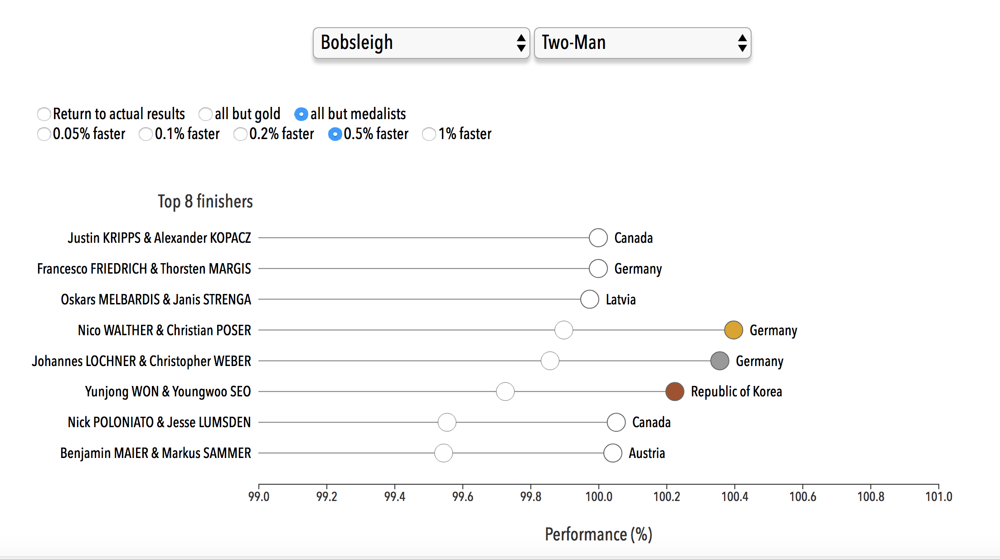
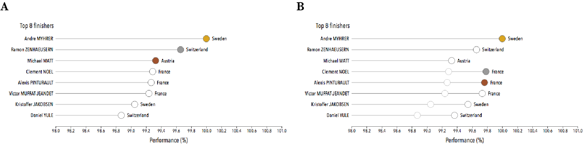
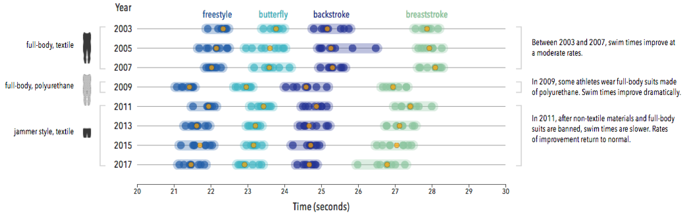

# On and Beyond the Edge
### Visual Stories of Winning Margins in Elite Sports

### Julian H. Lange

## Abstract
Olympic Games and World Championships showcase the world’s elite athletes. While medalists earn a significant
premium over fourth place finishers, the margins of victory have become vanishingly small. To surmount
these margins, athletes are continuously acquiring sources of advantage, from training to nutrition and
equipment, and, in some cases, illicit performance-enhancing substances. The trio of interactive visualizations
at https://julianhlange.github.io/thesis examines three stories from and beyond the edge of victory. First,
situated in the 2018 Winter Olympic Games, users are invited to test hypothetical scenarios in which athletes'
performances improve by small increments, from 0.05% to 1%. The second visualization highlights a
story from the swimming pool, where advances in swimsuit design effectively changed the parameters of a
sport. Finally, users can re-live the 2018 Winter Olympic Games men's singles luge event, which was won by
0.028 seconds, via an animation that displays the top eight athletes head-to-head.

### Features

##### Visualization 1
For each sport and discipline, competition data were acquired from the PyeongChang 2018 website of the
International Olympic Committee. I downloaded PDFs, converted them to CSV-formatted plain text
using an online tool, and scraped and tabulated relevant data using R version 3.3.3. Final tables were
compared with original data to confirm accurate processing. 
For each event in the visualization, the top eight finishers were included. The finishing time of each athlete
was converted to a measure of performance relative to the first-place finisher. For example, in the alpine
skiing men’s slalom event, the gold medalist Andre Myhrer completed the race in a time of 1:38.99 and the
silver medalist Ramon Zenhaeusern in a time of 1:39.33. With Myhrer’s performance set to 100%, Zenhaeusern’s
performance was calculated to be 99.66%. This arithmetic effectively converted relative performances
into a percentage of first place speed. 
Users select sport and discipline from dropdown menus. In a first view, the
actual results of the top eight finishers for the selected event are shown using the performance scale described
above. Users are then invited to test different scenarios in which the performances of subsets of the eight athletes––
either all competitors except the gold medalist or all non-medalists––are improved incrementally by
0.05%, 0.1%, 0.2%, 0.5%, or 1%. Users select the subset and increment with radio buttons. The data underlying
the transformed values were calculated in R. The resulting visualization displays how the
event’s standings would have changed under the userselected scenario. The visualization was implemented
using JavaScript and the D3.js library.

##### Visualization 2
Competitive swimsuit development underwent major changes in the first decade of the 21st century. The
most egregious example led to drastic rule changes that banned a synthetic material that, in 2009, had felled
many prior world records. This visualization conveys how swim times in 2009 were a function of swimsuit materials. 
World Championships are held biennially, so a visualization should reveal
any clear patterns. I created a visualization of the actual swim times of all 50-meter and 100-meter
men’s and women’s event finals (but not preliminary heats or semi-final races) from World Championships
between 2003 and 2017. Data were publicly available on the websites of FINA and OMEGA Timing, the
official timekeeper of FINA races. In all but two races, times were available for all eight athletes who competed;
in each of the remaining two races, one athlete was disqualified from the competition and no time was recorded.
The visualization was implemented using JavaScript and the D3.js library. 
If the pure-polyurethane swimsuits did provide a substantial advantage, then swim times should have
vastly improved between 2007, when the suits were not in use, and 2009. Furthermore, swim times should have
worsened in 2011, the first World Championships held after the ban went into effect. Indeed, this pattern was
observed in all 16 disciplines examined. Swim times improved gradually between 2003 and 2007, then
improved markedly in 2009. After full-body suits and polyurethane materials were banned in 2010, swim
times were much slower in 2011. Between 2011 and 2017, the rates of improvement in swim times were
more consistent with those of the early 2000s. The visualization shows clearly that, irrespective of gender, distance,
and stroke, winning swim times and median swim times improved between 2007 and 2009, then
slowed down between 2009 and 2011.

##### Visualization 3
Luge is a winter sliding sport in which one athlete, or a two-person team of athletes, lies face up on a racing sled
and steers the sled down an ice track. It has been part of the Winter Olympic program since 1964. The highest
level of international competition is governed by the Fédération Internationale de Luge de Course (FIL) and
is carried out on artificially constructed tracks. At the Olympics, each athlete in a singles competition completes
four runs of the track. The aggregate time of the four runs is determined to the thousandth of a second,
and the athlete with the shortest overall time is declared the winner. 
For the purposes of assessing the provisional standings of competitors while they are on the course, timing
wands are placed at several positions along the track. At the 2018 Winter Olympic Games in PyeongChang,
such ‘split times’ were measured at four locations along the track as well as at the finish line. Thus, a viewer
watching the competition could get a sense of provisional standings at each split time position and at the
finish line, for each of the four runs. This enabled viewers to assess each athlete’s performance during a run.
For example, a steering error that brought a sled into contact with a wall would show up in a subsequent split
time comparison. 
In PyeongChang, the men’s singles competition was held on February 10–11, 2018, with two runs on
each day. Forty athletes competed, each completing either three or four runs of around 47–50 seconds per
run. Thus, spread over two days, there were roughly two hours of actual racing. 
In creating a visualization of the men’s singles competition, I wanted to meet two main objectives. First, I
wanted to shorten the time taken to view the competition, from two hours spread over two days down to less
than one minute. Second, I wanted to display the results in a way that viewers could observe how close the racers
were at any time and could determine where the athletes made up or lost ground on their competitors. To
meet these objectives, I used published data from the race to create an animated representation of the top
eight finishers competing head-to-head on a track. 
Split times, finishing times, and velocities at each split position were publicly availably on the 2018 Winter
Olympic Games website. Timing wand positioning was provided through personal communication with FIL.
Distance measurements were converted to meters, time measurements to seconds, and velocities to meters per
second. Because times and velocities were only available at the split points, calculations were based on the assumption
of constant acceleration (or deceleration) in any interval.

### Credits
Created by [Julian H. Lange](www.julianhlange.com) with data and assets from the following sources:

* Data for the 2018 Winter Olympic Games were retrieved from the [PyeongChang 2018](https://www.pyeongchang2018.com) website.
* World Championships swimming results were obtained from [FINA](https://www.fina.org) and [OMEGA Timing](http://www.omegatiming.com/index.htm), the official timekeeper of FINA races.
* All data processing was performed with R version 3.3.3. Retrieved from [http://www.r-project.org](http://www.r-project.org).
* Flag images in the introductory text to the luge animation are by [Freepik](https://www.freepik.com).
* Visualizations were created in JavaScript and with libraries [D3.js](https://d3js.org) and [p5.js](https://p5js.org).